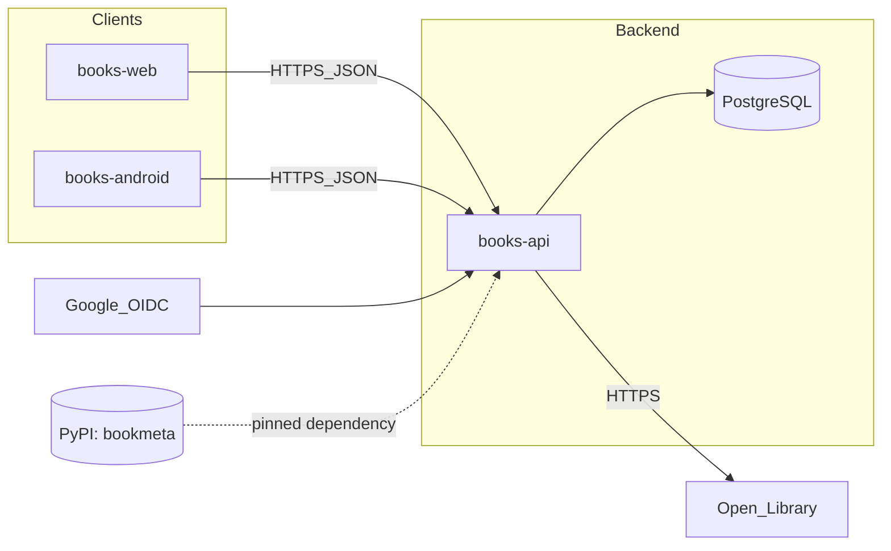

# Architecture Overview

## System Context

Books Tracker is a multi-client product with one backend API and one primary database.
Clients authenticate users with Google and call the backend over HTTPS.

## Container Responsibilities

- `books-api`: user auth/session management, business rules, validation, OpenAPI publication.
- `books-web`: responsive UI for desktop/tablet/mobile browser use.
- `books-android`: mobile-native Android UX using same HTTP contract.
- `PostgreSQL`: source of truth for users, books, reading sessions, shelves/lists.
- `bookmeta`: standalone Python library (own repo, published to PyPI) for ISBN handling and book
  metadata lookup. `books-api` depends on a pinned version; it never imports it from a local path.

## Data Flow

1. User signs in with Google from a client.
2. Client sends auth token/code to backend.
3. Backend validates identity and issues app session/JWT.
4. Client performs CRUD actions for books/reading progress via API.
5. Backend persists data in PostgreSQL and returns normalized payloads.

## Contract-First Rule

OpenAPI is the integration contract between API and clients.
Clients never import local code from other repositories; they consume generated clients or published artifacts.

## Deployment Targets

### Primary (GCP)

- API on Cloud Run.
- DB on Cloud SQL PostgreSQL.
- Secrets in Secret Manager.
- CI/CD via GitHub Actions OIDC federation.

### Out of scope: AWS

AWS is intentionally not covered in this course (see ADR-0001). The deployment design is kept
portable — stateless container, env-driven config, runtime-injected secrets — so a later AWS course
can map it to App Runner/ECS, RDS, and Secrets Manager.

## Non-Functional Priorities

- Testability (unit + integration + contract tests)
- Security (secrets management, least privilege, no plaintext keys)
- Independently deployable repositories
- Observability (structured logs, request IDs, basic uptime/error alerts)
